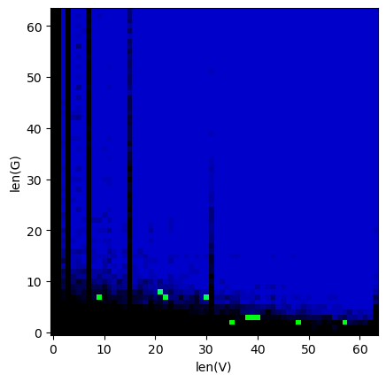

# Value-pooled perfect hashing

This is a small experiment exploring the idea of "value-pooled" [perfect hashing](https://en.wikipedia.org/wiki/Perfect_hash_function), where keys don't have to map to unique values. In such a regime, collisions between keys mapping to the same value are allowed, and even desirable, to reduce the storage space of the table. Here are my observations (and some thoughts):
* The minimal sizes of the intermediate table (`G`) and the value table (`V`) sufficient to represent a given mapping depend on the number of keys, the number of unique values (or palette items), as well as "luck" factors (thoroughness of solution search, distribution of the original values, hashing algorithm).
* The "compression ratio" is the best when there are only 2 palette items, and becomes worse the more palette items there are. However, it seems that this can be worked around by treating each bit of the palette index as part of the key (i.e., instead of `index = hashmap(key)`, it would be `index = (hashmap("0"+key) << 0) | (hashmap("1"+key) << 1) |  | (hashmap("2"+key) << 2) | ...`).
* There is a sort of "Pareto zone" of size-optimal solutions, where the number of bits needed to store a resulting table approximately follows the trend `size in bits = (K*B)*(1 + some overhead)`, where `K` is the number of keys, `B` is the number of bits required to store a palette index (and `K*B` is the "effective" number of keys), and overhead is typically in the range 5-25% (though maybe that's just for the small random examples I tested, and for real-world datasets the dependency/overhead would be different). Interestingly, this suggests that "value-pooled" hash table takes ~1.05-1.25 bits per key, which seems to be lower than the theoretical bound of ~1.44 bits per key, though it could well be that my calculations are wrong somewhere or the asymptotic behavior (when the number of keys is very large) would end up the same, or possibly worse, than the theoretical bound.
* At least on these small examples, it seems to be generally sufficient to do 500-1000 iterations of solution search for a given combination of `G` and `V` sizes to find whether a "good enough" solution exists, and past that point diminishing returns are typically hit very quickly (e.g. 10000 iterations don't provide a very big improvement in compression ratio).
* The relative benefit or disadvantage compared to other storage schemes would likely depend on how sparse or dense the stored keys are, compared to the full space of possible keys. E.g. for anything with spatial coherence (pixels, voxels) a tree-like structure is likely to use less memory, but for very sparse keys with little coherence (strings, binary blobs) this sort of hash map might be more compact.

(If you want to try running it yourself, the code is in the [pooled_hashing.ipynb](pooled_hashing.ipynb) Jupyter notebook)

## Example:

Results of optimal solution search for 64 keys and 2 values (10 runs averaged together):

